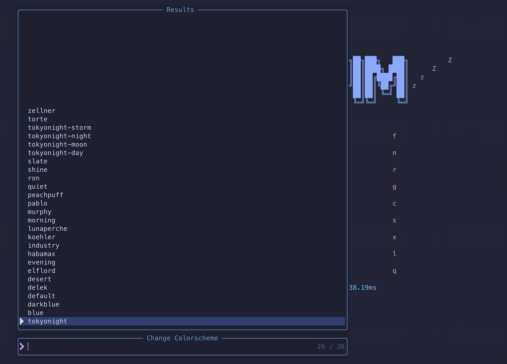
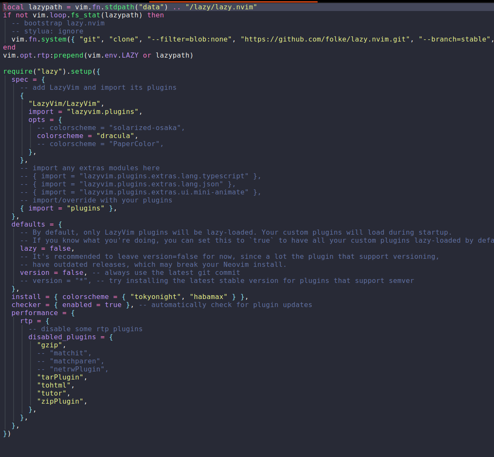
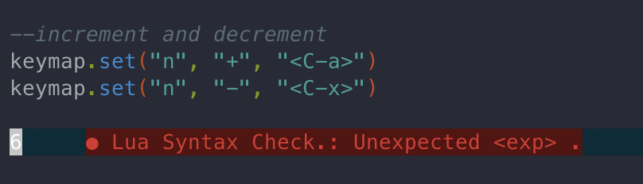
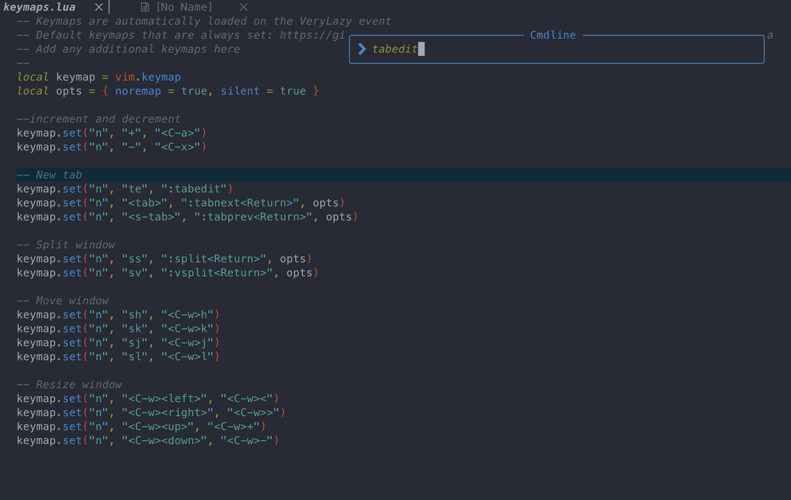
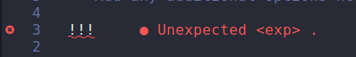
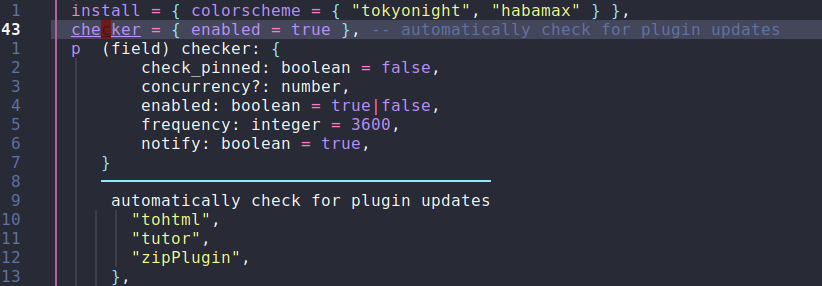
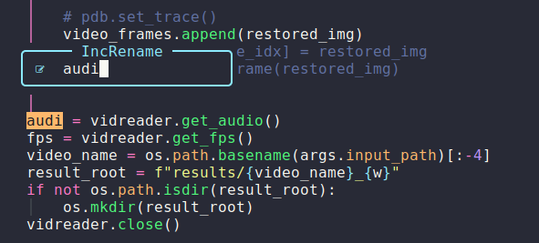
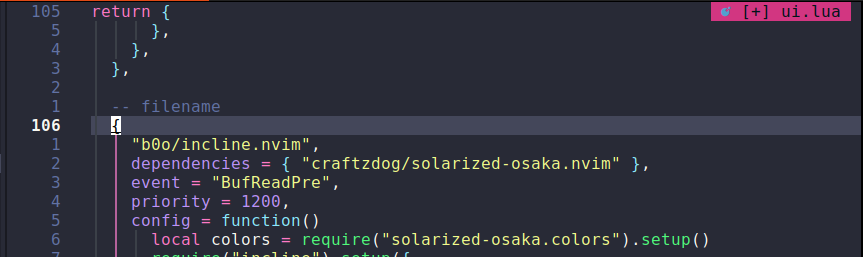
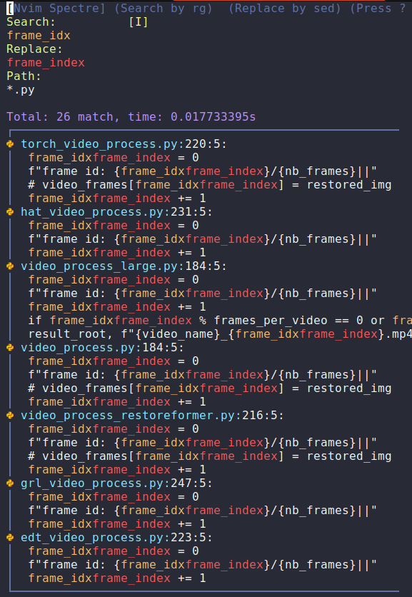
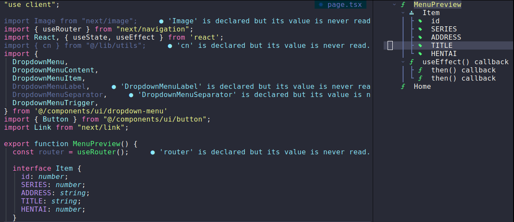

# my neovim config

this repository is not just what i configured for my neovim setup learned after reviewing great `neovim` setup tutorial by [Elijah Manor](https://www.youtube.com/watch?v=N93cTbtLCIM&ab_channel=ElijahManor), [devaslife](https://www.youtube.com/watch?v=fFHlfbKVi30&ab_channel=devaslife), [theprimeagen](https://www.youtube.com/watch?v=w7i4amO_zaE&ab_channel=ThePrimeagen), [Dreams of Code](https://www.youtube.com/watch?v=4BnVeOUeZxc&ab_channel=DreamsofCode), but also a note to remember basic usage how to use power of `neovim` editor

## Table of Contents

1. [Installation](#Installation)
2. [Setup](#setup)
   1.. [setup colorscheme](#setupcolorscheme)
   2.. [setup new](#colorscheme)

## Installation

- Clone the starter
  ```
  git clone https://github.com/LazyVim/starter ~/.config/nvim
  ```
- Remove the `.git` folder, so you can add it to your own repo later
  ```
  rm -rf ~/.config/nvim/.git
  ```
- Start Neovim!
  ```
  nvim
  ```
  Refer to the comments in the files on how to customize **LazyVim**.

[link](https://www.lazyvim.org/installation)

### install `fd` and `ripgrep`

#### mac OS

```
brew install fd ripgrep
```

#### Linux

```
sudo apt install fd-find
sudo apt-get install ripgrep
```

#### usage

type `leader` + `leader`:


## setup

### setup colorscheme

#### default colorscheme

`leader` + `u` + `C` to select colorscheme:



choose your own colorscheme:

```
nvim ~/.config/nvim/lua/plugins/colorscheme.lua
```

```python
return {
  "craftzdog/solarized-osaka.nvim",
  lazy = true,
  priority = 1000,
  opts = function()
    return {
      transparent = true,
    }
  end,
}
```

go to `~/.config/nvim/lua/config/lazy.nvim` line 12:

```lua
  spec = {
    -- add LazyVim and import its plugins
    { "LazyVim/LazyVim", import = "lazyvim.plugins", opts = {
      colorscheme = "solarized-osaka",
    } },
    -- import any extras modules here
    -- { import = "lazyvim.plugins.extras.lang.typescript" },
    -- { import = "lazyvim.plugins.extras.lang.json" },
    -- { import = "lazyvim.plugins.extras.ui.mini-animate" },
    -- import/override with your plugins
    { import = "plugins" },
  },

```

and new nvim will look like this:


same config setting for colorscheme Dracula:



[Link](https://linovox.com/the-best-color-schemes-for-neovim-nvim/)

### key maps

#### increment and decrement number

move cursor to number, press `Ctrl` + `a` or `x` to increase or decrease number by 1:



### tab control

```lua
-- New tab
keymap.set("n", "te", ":tabedit")
keymap.set("n", "<tab>", ":tabnext<Return>", opts)
keymap.set("n", "<s-tab>", ":tabprev<Return>", opts)
```

type `t` + `e`:



switch between tabs by going to next tab or go back to previous tab:

`<tab>` or `<s-tab>`

### windows control

#### resize windows

```
-- Resize window
keymap.set("n", "<C-w><left>", "<C-w><")
keymap.set("n", "<C-w><right>", "<C-w>>")
keymap.set("n", "<C-w><up>", "<C-w>+")
keymap.set("n", "<C-w><down>", "<C-w>-")
```

#### move windows

```
-- Move window
keymap.set("n", "sh", "<C-w>h")
keymap.set("n", "sk", "<C-w>k")
keymap.set("n", "sj", "<C-w>j")
keymap.set("n", "sl", "<C-w>l")
```

#### split windows

```
-- Split window
keymap.set("n", "ss", ":split<Return>", opts)
keymap.set("n", "sv", ":vsplit<Return>", opts)
```

### undercurl



```lua
-- Undercurl
vim.cmd([[let &t_Cs = "\e[4:3m"]])
vim.cmd([[let &t_Ce = "\e[4:0m"]])
```

### installing extras

`lazy.lua`

```lua
    { import = "lazyvim.plugins.extras.linting.eslint" },
    { import = "lazyvim.plugins.extras.formatting.prettier" },
    { import = "lazyvim.plugins.extras.lang.typescript" },
    { import = "lazyvim.plugins.extras.lang.json" },
    { import = "lazyvim.plugins.extras.lang.tailwind" },
    { import = "lazyvim.plugins.extras.lang.clangd" },
```

### hovering documentation

`shift` + `k`:



### noice setup

```lua
  {
    "folke/noice.nvim",
    opts = function(_, opts)
      table.insert(opts.routes, {
        filter = {
          event = "notify",
          find = "No information available",
        },
        opts = { skip = true },
      })
      local focused = true
      vim.api.nvim_create_autocmd("FocusGained", {
        callback = function()
          focused = true
        end,
      })
      vim.api.nvim_create_autocmd("FocusLost", {
        callback = function()
          focused = false
        end,
      })
      table.insert(opts.routes, 1, {
        filter = {
          cond = function()
            return not focused
          end,
        },
        view = "notify_send",
        opts = { stop = false },
      })

      opts.commands = {
        all = {
          -- options for the message history that you get with `:Noice`
          view = "split",
          opts = { enter = true, format = "details" },
          filter = {},
        },
      }

      vim.api.nvim_create_autocmd("FileType", {
        pattern = "markdown",
        callback = function(event)
          vim.schedule(function()
            require("noice.text.markdown").keys(event.buf)
          end)
        end,
      })

      opts.presets.lsp_doc_border = true
    end,
  },
```

### notification

```lua
{
	"rcarriga/nvim-notify",
	opts = {
		timeout = 5000,
	},
}
```

### rename



`IncRename` provides way renaming variables with preview features

Note that this requires language server pre-installed.

usage:
`leader` + `c` + `r`

go to file `lua/config/ui.lua` and setup:

```lua
  -- Incremental rename
  {
    "smjonas/inc-rename.nvim",
    config = function()
      require("inc_rename").setup()
    end,
  },
```

[link](https://github.com/smjonas/inc-rename.nvim)

### filename



add follow to file `ui.lua`:

```lua
  -- filename
  {
    "b0o/incline.nvim",
    dependencies = { "craftzdog/solarized-osaka.nvim" },
    event = "BufReadPre",
    priority = 1200,
    config = function()
      local colors = require("solarized-osaka.colors").setup()
      require("incline").setup({
        highlight = {
          groups = {
            InclineNormal = { guibg = colors.magenta500, guifg = colors.base04 },
            InclineNormalNC = { guifg = colors.violet500, guibg = colors.base03 },
          },
        },
        window = { margin = { vertical = 0, horizontal = 1 } },
        hide = {
          cursorline = true,
        },
        render = function(props)
          local filename = vim.fn.fnamemodify(vim.api.nvim_buf_get_name(props.buf), ":t")
          if vim.bo[props.buf].modified then
            filename = "[+] " .. filename
          end

          local icon, color = require("nvim-web-devicons").get_icon_color(filename)
          return { { icon, guifg = color }, { " " }, { filename } }
        end,
      })
    end,
  },
```

### personal logo

add follow to file `ui.lua`:

```lua
  {
    "nvimdev/dashboard-nvim",
    event = "VimEnter",
    opts = function(_, opts)
      local logo = [[
      ██╗  ██╗ █████╗ ██████╗ ██╗     ███████╗██╗   ██╗
      ██║  ██║██╔══██╗██╔══██╗██║     ██╔════╝╚██╗ ██╔╝
      ███████║███████║██║  ██║██║     █████╗   ╚████╔╝
      ██╔══██║██╔══██║██║  ██║██║     ██╔══╝    ╚██╔╝
      ██║  ██║██║  ██║██████╔╝███████╗███████╗   ██║
      ╚═╝  ╚═╝╚═╝  ╚═╝╚═════╝ ╚══════╝╚══════╝   ╚═╝
      ]]

      logo = string.rep("\n", 8) .. logo .. "\n\n"
      opts.config.header = vim.split(logo, "\n")
    end,
  },
```

### TODO handling

a. first type uppercase `todo`:
![[neovim-todo.png]]

b. secondly search `todo` by typing `leader` + `s` + `t`:
and all `todo` task will be shown

### search and replace

usage: `leader` + `s` + `r`



confirm it by pressing `leader` + `R`

### issue: pyright, import [module] could not be resolved

```bash
├── manage.py
├── movie
│   ├── admin.py
│   ├── apps.py
│   ├── __init__.py
│   ├── models.py
│   ├── tests.py
│   └── views.py
├── moviereviews
│   ├── asgi.py
│   ├── __init__.py
│   ├── settings.py
│   ├── urls.py
│   └── wsgi.py
└── pyproject.toml
```

create `pyproject.toml` would be:

```python
[tool.pyright]
include = ["movie", "moviereviews"]
```

[reference](https://stackoverflow.com/questions/59108805/fixing-import-module-could-not-be-resolved-in-pyright)

### nvim-surround

`nvim-surround` operations:

- `Add`: `gsa` + `iw` + {character}, add `iw` before desired character, `iw` by means is inside word in motion
- `Change`: `gsr` + {surrounding character} + {new character}
- `Delete`: `gsd` + {surrounding character}
- `Copy`: `.`, go to next word, and paste previous character to current word

below `nvim-surround` not working properly in `visual` mode, now switch back to `surround.nvim`

```
return {
    "kylechui/nvim-surround",
    version = "*", -- Use for stability; omit to use `main` branch for the latest features
    event = "VeryLazy",
    config = function()
        require("nvim-surround").setup({
            -- Configuration here, or leave empty to use defaults
        })
    end
}
```

- [Link: mini.surround](https://github.com/echasnovski/mini.surround)
- [source](https://github.com/kylechui/nvim-surround)
- [Link: nvim-surround](https://www.youtube.com/watch?v=96FS45IaUgo&ab_channel=NerdSignals)

### symbols outline

usage:

`leader` + `c` + `s`

result:



## Diff

### horizontal split

open a new window on the file {filename}.

```
:diffs {filename}
```

To make these commands use a vertical split:

```
:vert diffsplit main.c~
:vert diffpatch /tmp/diff
```

[Reference](https://neovim.io/doc/user/diff.html)

## Reference

- [Zero to IDE with LazyVim](https://www.youtube.com/watch?v=N93cTbtLCIM)
- [Effective Neovim setup for web development towards 2024](https://github.com/craftzdog/dotfiles-public)
- [Neovim Installation](https://www.lazyvim.org/installation)
- [The perfect Neovim setup for Python](https://www.youtube.com/watch?v=4BnVeOUeZxc)
